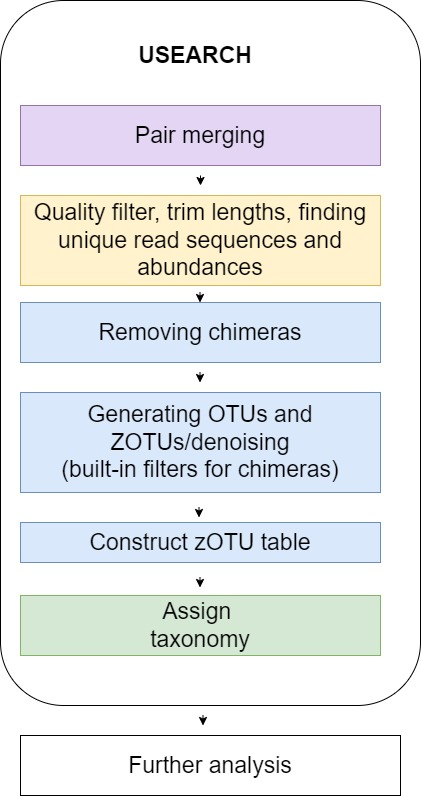

# BaikalCommunities
This is the github repository along our project  'Comparative analysis of free-living (FL) and particle-associated (PA) bacterial communities in the photic layer of Lake Baikal using rRNA metabarcoding".


> Scripts

All scripts are located in the `Usearch_scripts` and `DADA2_scripts` folders.

> Illustrations

The images for illustrating the repositry's readme files are located in the `Illustrations` folder.


## Introduction

Lake Baikal is an oligotrophic water body with low concentration of nutrients. During the ice period, the upper layer of water near the bottom surface of the ice is increasingly enriched with nutrients due to salting out processes which promotes the development of microorganisms. The goal of the project is to identify similarities and differences in communities of bacteria and microeukaryotes living on the bottom surface of the ice and water column of Lake Baikal using metabarcoding of 16S and 18S rRNA gene fragments. 

## Aims

Identify seasonal changes in biodiversity and structure of FL and PA bacterial communities

## Tasks

1. Compare the results of sequencing data processing using two pipelines USEARCH10/11 (32 bit) and DADA2;
2. Data processing: read merging, primer trimming, high-quality filtering, removal of mitochondrial, chloroplast and unknown reads;
3. Obtaining data on the taxonomic structure and biodiversity of bacterial and microeukaryotic communities.


## Data
Instrument: Illumina MiSeq

Strategy: AMPLICON

Source: METAGENOMIC

Selection: PCR

Layout: PAIRED

V3–V4 region of 16S rRNA were analyzed for bacterial diversity and V8–V9 region of 18S rRNA for eukaryotic diversity.

OTU sequences were taxonomically classified using SILVA v.132 (Bremen, Germany) for eukaryotic diversity 
and rdp_16s_v18 for bacterial diversity.

We have analyzed FL and PA bacteria and microeukaryotic community composition of PA samples from the photic layer of Lake Baikal. The samples were taken from various depths, distances from the shore and seasons. For 37 bacterial community samples a total of 307,100 reads were produced and 185,600 reads for 20 microeukaryotic community. Six samples (V1PL-7-PA, V2UI-10-FL, V2UI-5-PA, V2UI-10-PA, V3UI-5-PA and UW2/30_5) were excluded from further analysis, due to a low coverage. Rarefaction curves suggested that the sequencing effort was enough to estimate the community diversity, although the analysis of PA bacterial communities could benefit from further sequencing.

In this work we used previously published data. The raw sequencing available from Sequence Read Archive database (https://www.ncbi.nlm.nih.gov/sra, 19 December 2022) of the National Center for Biotechnology Information under the BioProject number PRJNA913685.

Bacterial community samples with identification numbers 'V1UI-0-FL', 'V1UI-0-PA', 'V1UI-5-FL', 'V1UI-5-PA', 'V2UI-0-FL', 'V2UI-0-PA', 'V2UI-5-FL', 'V2UI-30-FL', 'V2UI-30-PA', 'V3UI-0-FL', 'V3UI-0-PA', 'V3UI-5-FL', 'V3UI-10-FL', 'V3UI-10-PA', 'V3UI-30-FL', 'V3UI-30-PA', 'V1PL-0-FL', 'V1PL-0-PA', 'V1PL-3-FL', 'V1PL-3-PA', 'V1PL-7-FL', 'V2PL-0-FL', 'V2PL-0-PA', 'V2PL-5-FL', 'V2PL-5-PA', 'V2PL-10-FL', 'V2PL-10-PA', 'V2PL-30-FL', 'V2PL-30-PA', 'V3PL-0-FL', 'V3PL-0-PA', 'V3PL-5-FL', 'V3PL-5-PA', 'V3PL-10-FL', 'V3PL-10-PA', 'V3PL-30-FL', 'V3PL-30-PA' and microeukaryotic community samples with identification numbers  'UW1/0_5','UW1/5_5','UW2/0_5', 'UW2/5_5', 'UW2/10_5', 'UW3/0_5', 'UW3/5_5', 'UW3/10_5', 'UW3/30_5', 'PL1/0_5', 'PL1/3_5', 'PL1/7_5', 'PL2/0_5', 'PL2/5_5', 'PL2/10_5', 'PL2/30_5', 'PL3/0_5', 'PL3/5_5', 'PL3/10_5', 'PL3/30_5' were included in our analysis.

Metadata are situated in the `data` folder.

Example fastq files for 16S and 18S data processing you can find in `16S_examples` and `18S_examples` folders resperctively.

### Workflow plan

The principal scheme of the pipeline is in the figure below. 

### Workflow plan and technical properties

#### Technical properties and requirements
> The pipeline was run on the local machine with OS Zorin 15.3. The package manager was conda 23.3.1 (miniconda). 
Python version was 3.11.0. Bash version was 4.4.20(1)-release (x86_64-pc-linux-gnu). R version was 4.3.3. vegan 2.6-4
Data processing was perfomed with USEARCH (32 bit) in version 10 or 11 + Vegan 2.6-4 community ecology R package and DADA2 + phyloseq R package. To run this pipeline you also need R packages: dplyr(v.1.1.4), seqinr (v.4.2-36), ggplot2 (v.3.5.0), cowplot (v.1.1.3), readxl (v.1.4.3), tibble (v.3.2.1).


##### Usearch+vegan pipeline for 16S data processing

1. ```01_usearch_data_processing.sh``` - data processing: read merging, primer trimming, high-quality filtering (expected error threshold 1.0 (option -fastq_maxee 1.0)), finding unique read, predicting biological sequences, filtering chimeras, making zOTU table, taxonomy prediction, removal of mitochondrial, chloroplast and unknown reads;

2. ```02_log_chloroplast_script.R``` - removing chloroplasts and mitochondria from the BD.zotus.fa, BD.z_sintax.txt and BD.zotutab.txt files (in R language). Then carry out further analysis;

Warning: after processing the BD.zotutab.txt with log_chloroplast_script, it is necessary to rename the first column in the filtered BD.zotutab_filtr.txt from X.OTU.ID to OTU.ID for further analysis;

3. ```03_zOTU_removing_script.R``` - check the taxonomy of the first 20 zOTUs with BLAST and remove zOTUs with low confidence in the taxonomy definition using zOTU_removing_script (in this step you will get updated_BD.zotutab_filtr.txt, updated_BD.z_sintax_filtr.txt and updated_BD.zotus_filtr.fa" without zOTUs with low confidence in the taxonomy definition)

4. ```04_usearch_data_processing.sh``` - taxonomy summary reports and statistics report generation
5. ```05_rarecurve_script.R``` - generate rarefaction curves for the PA data
6. ```06_NMDS_plot_script.R``` - construction NMDS plot
7. ```07_alpha_diversity_script.R``` - species diversity assessment
8. ```08_boxplot_script``` - visualization of species diversity assessment
9. ```09_phylum_relative_abundance_script_275_combi.R``` - visualisation of relative abundance at the phylum level
10.```10_class_relative_abundance_script_275_combi.R``` -  visualisation of relative abundance at the classes level
11.```11_genus_relative_abundance_script_275_combi.R``` - visualisation of relative abundance at the genus level


##### Usearch+vegan pipeline for 18S data processing

1. ```01_usearch_data_processing_18s.sh``` - data processing: read merging, primer trimming, high-quality filtering (expected error threshold 1.0 (option -fastq_maxee 1.0)), finding unique read, predicting biological sequences, filtering chimeras, making zOTU table, taxonomy prediction, removal of mitochondrial, chloroplast and unknown reads;

2. ```02_log_metazoa_script_18s.R`` - removing chloroplasts and mitochondria from the BD.zotus.fa, BD.z_sintax.txt and BD.zotutab.txt files (in R language). Then carry out further analysis;

Warning: after processing the BD.zotutab.txt with log_chloroplast_script, it is necessary to rename the first column in the filtered BD.zotutab_filtr.txt from X.OTU.ID to OTU.ID for further analysis;

3. ```03_zOTU_removing_script_18s.R``` - check the taxonomy of the first 20 zOTUs with BLAST and remove zOTUs with low confidence in the taxonomy definition using zOTU_removing_script (in this step you will get updated_BD.zotutab_filtr.txt, updated_BD.z_sintax_filtr.txt and updated_BD.zotus_filtr.fa" without zOTUs with low confidence in the taxonomy definition)

4. ```04_usearch_data_processing_18s.sh``` - taxonomy summary reports and statistics report generation
5. ```05_rarecurve_script_18s.R``` - generate rarefaction curves for the PA data
6. ```06_NMDS_plot_script_18s.R``` - construction NMDS plot
7. ```07_alpha_diversity_script_18s.R``` - species diversity assessment
8. ```08_boxplot_script_18s.R``` - visualization of species diversity assessment
9. ```09_phylum_relative_abundance_script_18s.R``` - visualisation of relative abundance at the phylum level
10.```10_class_relative_abundance_script_18s.R``` -  visualisation of relative abundance at the classes level
11.```11_family_relative_abundance_script_275_18s.R``` - visualisation of relative abundance at the family level


## Results and discussion

Results obtained with USEARCH10/11 and DADA2 are different (mostly in richness and biodiversity). Abundance estimation results are similar for the two approaches. USEARCH-UNOISE3 showed higher sensitivity. DADA2 showed higher biological resolution


## Literature

1. Bashenkhaeva, M.; Yeletskaya, Y.; Tomberg, I.; Marchenkov, A.; Titova, L.; Galachyants, Y. Free-Living and Particle-Associated Microbial Communities of Lake Baikal Differ by Season and Nutrient Intake. Diversity 2023, 15, 572. https://doi.org/10.3390/d15040572.

2.Bukin YS, Mikhailov IS, Petrova DP, Galachyants YP, Zakharova YR, Likhoshway YV. The effect of metabarcoding 18S rRNA region choice on diversity of microeukaryotes including phytoplankton. World J Microbiol Biotechnol. 2023 Jun 21;39(9):229. doi: 10.1007/s11274-023-03678-1. PMID: 37341802.

3.Mikhailov, I.S., Galachyants, Y.P., Bukin, Y.S. et al. Seasonal Succession and Coherence Among Bacteria and Microeukaryotes in Lake Baikal. Microb Ecol 84, 404–422 (2022). https://doi.org/10.1007/s00248-021-01860-2.
4.Prodan A, Tremaroli V, Brolin H, Zwinderman AH, Nieuwdorp M, Levin E. Comparing bioinformatic pipelines for microbial 16S rRNA amplicon sequencing. PLoS One. 2020 Jan 16;15(1):e0227434. doi: 10.1371/journal.pone.0227434.

## Authors

 - Kristina Zhur, 
 - Aleksei Sivtsev
 - Maria Bashenkhaeva* (Limnological Institute SB RAS)
 - Polina Drozdova* (Irkutsk State University)

\* project supervisor 

## Feedback

You can write us about any problems or ideas about project improvements on telegram @ZhurKristina 
